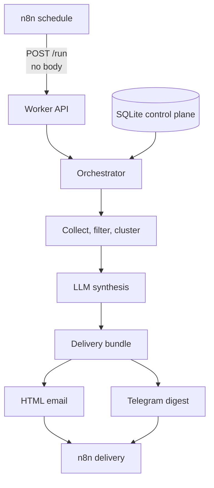

# News 4 Legends

> **The goal isn't to help you consume more news. It's to make it safe to consume less.**

News 4 Legends is a self-hosted personal intelligence briefing system. You choose the subjects and sources that deserve attention; it collects recent reporting, removes repetition, groups related coverage, uses an LLM to synthesize the signal, and delivers a scheduled briefing by HTML email, Telegram, or both.

The profiles are yours. The sources are yours. The machine watches them so you do not have to.

## Why it exists

The modern news cycle rewards volume: more feeds, alerts, tabs, and scrolling. News 4 Legends takes the opposite approach. It gives you a finite briefing instead of another infinite feed. It has no built-in opinion about what matters: a profile can track a football club, cybersecurity, a company, a place, a technology, or an obscure personal interest.

## Features

- Simplified web UI for profiles, keywords, story count, sources, budgets, and delivery preferences.
- Persistent SQLite control plane.
- Automatic discovery of enabled profiles; adding one needs no Python, cron, or n8n change.
- Source preflight with `PASS`, `WARNING`, and `FAIL` results.
- Bounded collection, freshness filtering, deduplication, clustering, and prioritization.
- OpenAI-compatible chat-completions endpoint for synthesis.
- One collection/synthesis run renders both email and Telegram.
- Seven-day worker run logs, available from the UI or `GET /logs`.
- Zero-LLM maintenance checks with dynamic version discovery, structured
  current/history reports, branch-aware advisory classification, and a
  read-only Security dashboard.
- n8n scheduling and delivery, with example delivery nodes disabled by default.
- Private-server design; it is not hardened as a public Internet service.

## How it works



The UI is the profile control plane. The automation layer never selects an individual profile. One bodyless `POST /run` discovers all enabled profiles and returns `profiles_processed`, `email`, and `telegram`. Collection, clustering, and synthesis happen once; enabling two delivery channels does not double that work.

## Requirements

A comfortable small installation uses Debian 12, 2 vCPU, 4 GB RAM, 30–40 GB disk, Docker Engine with Compose, an OpenAI-compatible remote LLM endpoint, and optional SMTP email and/or Telegram delivery. No GPU is required for remote inference. Actual needs depend on profile/source count and collection volume.

## Quick start

For a blank server, follow the [full installation guide](docs/INSTALLATION-FULL.md). On an existing Docker host:

```bash
git clone https://github.com/vbian88/news4legends.git
cd news4legends
cp .env.example .env
mkdir -p secrets
printf '%s' 'PASTE_YOUR_LLM_API_KEY_HERE' > secrets/llm_api_key
chmod 600 secrets/llm_api_key
```

Edit `.env`, replacing every placeholder. Then:

```bash
docker compose config --quiet
docker compose up -d --build
docker compose ps
curl --fail http://127.0.0.1:8081/health
docker compose exec news4legends-worker python -c "import urllib.request; print(urllib.request.urlopen('http://127.0.0.1:8080/health').read().decode())"
```

Open `http://NEWS_SERVER_IP:8081`, create a profile, add and validate a source, and enable the profile. Import [`n8n/workflow.example.json`](n8n/workflow.example.json), configure a delivery channel, execute it manually, then activate and **Publish** the workflow.

## Delivery choices

| Mode | Nodes to enable | Expression |
| --- | --- | --- |
| Email | SMTP | `{{ $json.email }}` |
| Telegram | Telegram | `{{ $json.telegram }}` |
| Both | Both | Both expressions |

Telegram is deliberately compact and uses an approximately 4,000-character combined budget. Email uses client-compatible table markup and inline CSS. Internal story links are best-effort because email-client support varies.

## Documentation

- [Full installation](docs/INSTALLATION-FULL.md)
- [Architecture](docs/ARCHITECTURE.md)
- [Profiles and sources](docs/PROFILES-AND-SOURCES.md)
- [n8n](docs/N8N.md)
- [Telegram](docs/TELEGRAM.md)
- [SMTP email](docs/SMTP.md)
- [Operations](docs/OPERATIONS.md)
- [Backup and restore](docs/BACKUP-RESTORE.md)
- [Upgrading](docs/UPGRADING.md)
- [Troubleshooting](docs/TROUBLESHOOTING.md)
- [Maintenance and security monitoring](docs/MAINTENANCE-SECURITY.md)
- [Security](SECURITY.md)

## Security model

News 4 Legends assumes private, trusted access. The UI and worker have no application authentication. Do not expose the UI, worker, or n8n directly to the Internet without TLS, authentication, and access controls. Secrets stay outside version control. Review [SECURITY.md](SECURITY.md).

Security checks, classifications, alerts and guidance are best-effort information, not a guarantee of security or a substitute for professional assessment. A finding does not necessarily prove exploitability, and no findings does not mean a deployment is secure. See the full [security disclaimer](SECURITY.md#best-effort-security-information-and-disclaimer) and the MIT License's warranty and liability terms.

Source credibility values are user-defined priority/importance weights, not objective truth scores.

## Repository structure

```text
.
├── compose.yml                 # Services, volumes, networks
├── config/collector.yaml       # Generic collection defaults
├── docker/                     # Image definitions and requirements
├── docs/                       # Manuals
├── n8n/workflow.example.json   # Sanitized inactive workflow
├── maintenance/                # Zero-LLM advisory checks and reports
├── ui/                         # Control plane and DB bootstrap
├── worker/                     # Collection and synthesis pipeline
├── secrets/                    # Local secret mount
├── .env.example               # Safe template
└── SECURITY.md
```

The UI writes `/data/home-ai-news.db`; the worker sees the same volume read-only at `/config/home-ai-news.db`. These are two paths to one database.

## Worker API

| Method | Route | Purpose |
| --- | --- | --- |
| `GET` | `/health` | Liveness |
| `GET` | `/logs` | Download the latest retained worker run log |
| `POST` | `/preflight` | Validate JSON `listing_url` |
| `POST` | `/run` | Run all enabled profiles; no body |

Historical Roma-specific routes are not public API. Profiles and sources belong in SQLite through the UI, not in `collector.yaml` or the `/run` body.

## License

News 4 Legends is released under the [MIT License](LICENSE).

## Assets and third-party content

This publication contains no photographs, club logos, or other external third-party images. This avoids implying that the MIT License grants rights to third-party visual material. See [Third-party assets](THIRD-PARTY-ASSETS.md).
