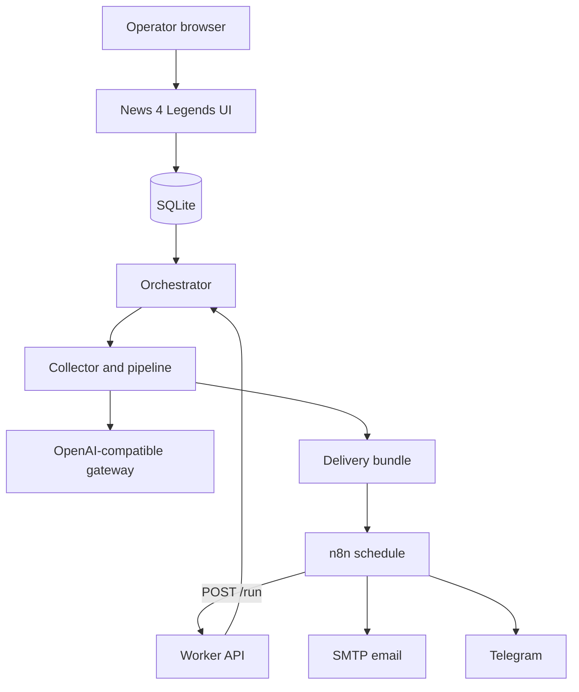
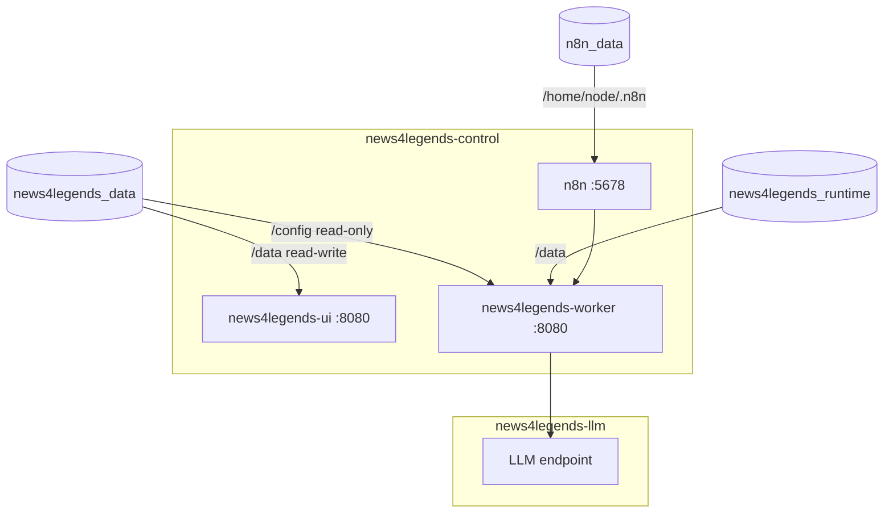
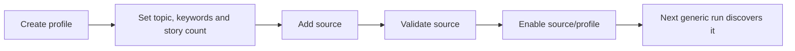
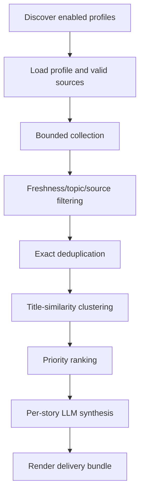
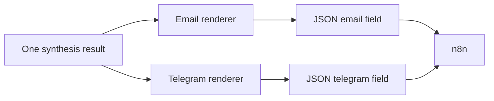
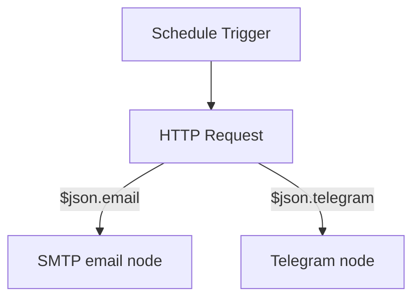

# Architecture

News 4 Legends separates configuration, intelligence processing, and delivery. The UI/SQLite database is the control plane; n8n is only the scheduler and delivery adapter.

## System overview

`POST /run` has no request body. The orchestrator queries SQLite for all enabled profiles. A new enabled profile joins the next run without code, YAML, schedule, workflow, or HTTP-body changes.

## Containers, networks, and volumes

The UI database path is `/data/home-ai-news.db`; the worker path is `/config/home-ai-news.db`. Both refer to `news4legends_data`. The worker stores seven-day run logs under `/data/logs` in `news4legends_runtime`. It also receives `config/collector.yaml` and a read-only LLM secret mount. The worker has no host-published port; n8n reaches it by Compose service DNS.

`news4legends-control` links internal services. `news4legends-llm` isolates the worker's gateway-facing path and is useful when an LLM gateway joins that Docker network. An externally hosted endpoint is also supported if reachable from the worker.

## Profile control plane

SQLite schema version 1 has exactly five application tables:

| Table | Responsibility |
| --- | --- |
| `profiles` | Identity, topic, enablement, thresholds, budgets, LLM and delivery settings |
| `sources` | Reusable source names |
| `profile_sources` | Per-profile URL, collector, weighting, budgets, validation, enablement |
| `profile_keywords` | Profile keyword set |
| `profile_entities` | Profile entity set |

`listing_url` and `collector_type` belong to `profile_sources`, not `sources`. The bootstrap creates an empty version-1 database, preserves an existing version-1 database, and refuses an unexpected schema/version rather than migrating blindly.

## Processing pipeline

Generic request defaults live in `config/collector.yaml`; profile topics and sources do not. User-defined source weights influence priority but are not objective truth scores.

The LLM client uses a configurable OpenAI-compatible endpoint. Public `LLM_API_URL` and `LLM_MODEL` values are mapped by Compose to historical internal `OMNIROUTE_*` names. OmniRoute is known to work but is not mandatory.

## Delivery bundle

Email uses table-based HTML, inline CSS, escaped dynamic values, deterministic themes, executive overview, story cards, sources, and timestamps. `Auto` theme selection is application logic, not an LLM call. Story-anchor navigation is best-effort across email clients.

Telegram is more compact. The orchestrator fairly shares an approximately 4,000-character global budget among profile digests. Rendering either format makes no extra LLM call.

## n8n delivery

Both example delivery nodes are disabled until credentials and destinations are configured. Changes intended for scheduled execution must be **Published**.

## SMTP delivery boundary

n8n owns SMTP credentials and sends the worker's rendered `email` field. The worker never receives the SMTP password and does not perform a second collection or LLM pass for email. The public workflow contains placeholders and no credential binding.

## Failure boundaries

- Invalid/unexpected SQLite schema stops bootstrap rather than mutating data.
- Source validation is bounded and records `PASS`, `WARNING`, or `FAIL`.
- Collection budgets constrain time, requests, fetches, and article counts.
- A single LLM story failure can fall back without terminating the whole briefing; if every attempted synthesis fails, the pipeline raises a systemic failure instead of silently presenting a fully degraded result as success.
- A profile subprocess failure is surfaced by the orchestrator/worker; inspect returned stderr.
- Delivery failure in n8n does not repeat collection automatically unless workflow retry behavior is configured.
- The worker captures child stdout/stderr, so live child progress may not appear in Docker logs; use `docker top`.

## API surface

- `GET /health`
- `GET /logs` (latest retained run log)
- `POST /preflight` with a JSON `listing_url`
- `POST /run` with no body

Historical `/run-test`, `/run-roma`, and Roma-specific commands are deliberately absent.

## Maintenance/security boundary

The host-run `maintenance/` scripts use no LLM. They dynamically query configured running containers for installed versions, obtain public advisories, classify confirmed matches or `UNCERTAIN` cases, and write runtime JSON/text under an ignored reports directory. Compose exposes only that report directory to the UI as a read-only mount. The dashboard cannot execute checks or upgrades.
