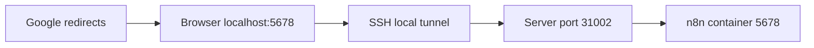

# Gmail delivery and OAuth

This guide configures n8n to send the HTML `email` field through Gmail. Google console labels and review rules can change; choose the minimum scope that supports the n8n Gmail send operation.

## Architecture

Normal access uses `http://NEWS_SERVER_IP:31002`. A private LAN address is not accepted as the normal Google redirect in this deployment, so OAuth bootstrap temporarily uses a localhost callback and SSH tunnel.



The tunnel is temporary. It is not a reverse proxy and is not needed for later email delivery.

## 1. Configure Google Cloud

In Google Cloud Console:

1. Create or select a dedicated project.
2. Enable the Gmail API.
3. Configure OAuth consent/branding and support contact.
4. Choose the user type appropriate to the account/domain.
5. Add your Gmail account as a test user if the app remains in testing.
6. Add only the least-privilege Gmail scope required to create/send messages.
7. Create an OAuth client of type **Web application**.
8. Add the authorized redirect URI exactly: `http://localhost:5678/rest/oauth2-credential/callback`.
9. Store the client ID and client secret privately.

Do not commit the client secret or download it into the repository.

## 2. Temporarily switch n8n to localhost URLs

**What you're doing:** Making n8n generate a callback that exactly matches Google.

**Command — server:**

```bash
cd /opt/news4legends
cp .env ".env.before-gmail-oauth.$(date +%Y%m%d-%H%M%S)"
nano .env
```

Temporarily set:

```dotenv
N8N_EDITOR_BASE_URL=http://localhost:5678
WEBHOOK_URL=http://localhost:5678/
```

Apply only the n8n service:

```bash
docker compose up -d --force-recreate n8n
docker compose ps n8n
```

**What you should see:** n8n remains running and its environment reports localhost values if inspected.

**If you don't see it:** Run `docker compose config` and n8n logs; correct `.env` syntax.

**Don't continue until n8n is healthy.**

## 3. Create the SSH local forward

The exact historical laptop command was not captured. The following is an example template for this Compose layout, where host port 31002 forwards to container port 5678:

**Command — administrator laptop, keep terminal open:**

```bash
ssh -N -L 5678:127.0.0.1:31002 ADMIN_USER@NEWS_SERVER_IP
```

**What you should see:** The command stays open without a shell. In a browser, `http://localhost:5678` opens n8n.

**If you don't see it:** Ensure local port 5678 is free, SSH works, server port 31002 is listening, and n8n is running. If deployment port mapping differs, adjust the tunnel target deliberately.

**Don't continue until localhost opens the intended n8n instance.**

## 4. Authorize Gmail in n8n

Through `http://localhost:5678`:

1. Create a Gmail OAuth2 credential.
2. Enter the private client ID and secret.
3. Confirm n8n shows the same localhost callback URI registered in Google.
4. Start authorization, choose the intended Google account, review requested scope, and allow.
5. Save and test the credential.

**What you should see:** n8n reports the credential connected.

**If you don't see it:** For `redirect_uri_mismatch`, compare scheme, host, port, path, and trailing characters exactly. For access denied, check consent-screen state, test users, account/domain policy, and scopes.

**Don't continue until the credential connects.**

## 5. Restore normal LAN URLs

Close the laptop tunnel. On the server edit `.env` back to:

```dotenv
N8N_EDITOR_BASE_URL=http://NEWS_SERVER_IP:31002
WEBHOOK_URL=http://NEWS_SERVER_IP:31002/
```

Then:

```bash
cd /opt/news4legends
docker compose up -d --force-recreate n8n
docker compose ps n8n
```

Open the normal LAN URL and confirm the Gmail credential still exists. Never leave localhost values as the normal deployment configuration unless localhost truly is the intended access path.

## 6. Configure the Gmail node

Use:

- Resource: Message
- Operation: Send
- Email type: HTML
- To: a controlled recipient placeholder replaced with the real address in n8n only
- Subject: `News 4 Legends — Daily Intelligence Digest`
- Message: `{{ $json.email }}`

Use CC when all recipients may see each other. Use BCC when distributing one private digest without exposing recipient addresses. Recipient fields are stored in workflow parameters and can leak through exports.

## 7. Test and publish

Execute the HTTP node and confirm `email` begins with HTML content. Execute Gmail.

**What you should see:** A formatted HTML digest in the intended mailbox, including source links and timestamp.

**If you don't see it:** Check n8n execution, spam, recipient fields, credential state, and HTML mode. If markup appears literally/plain, the node is not configured as HTML.

**Don't continue until manual delivery is correct.**

Execute the full workflow, set schedule/timezone, activate, and **Publish**. A saved draft alone may not change scheduled behavior.

## OAuth maintenance

Tokens can be revoked by the user, Google policy, password/security changes, app testing expiry, or client deletion. If reauthorization is needed, repeat the temporary localhost/tunnel flow. Do not delete the working n8n volume or OAuth client as a first troubleshooting step.

